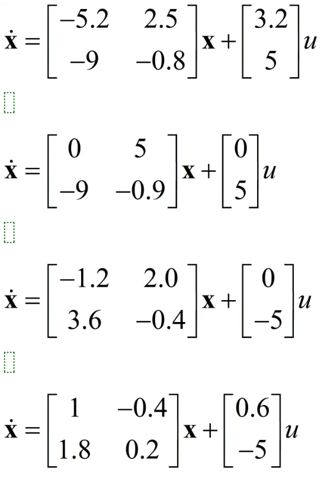
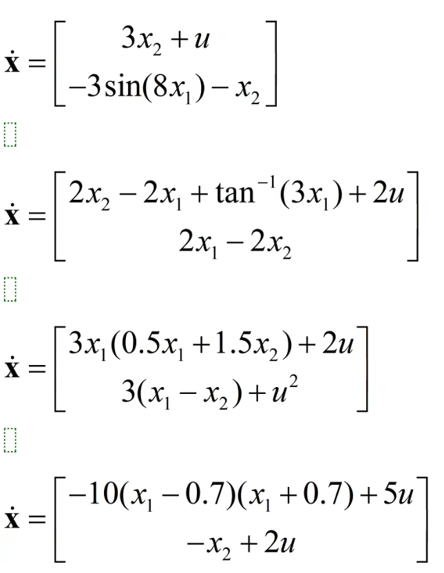
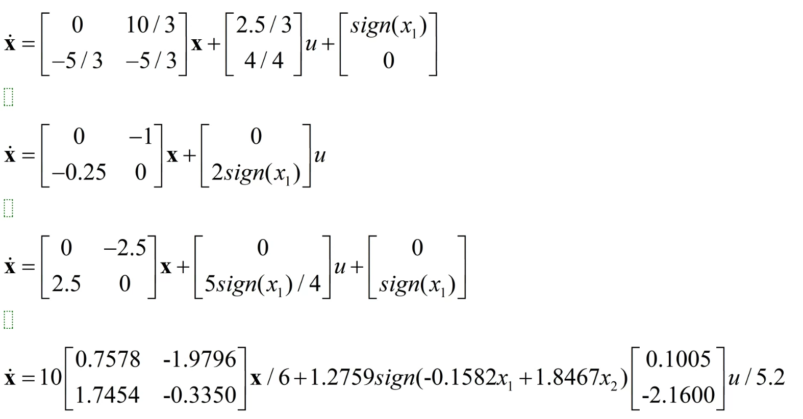
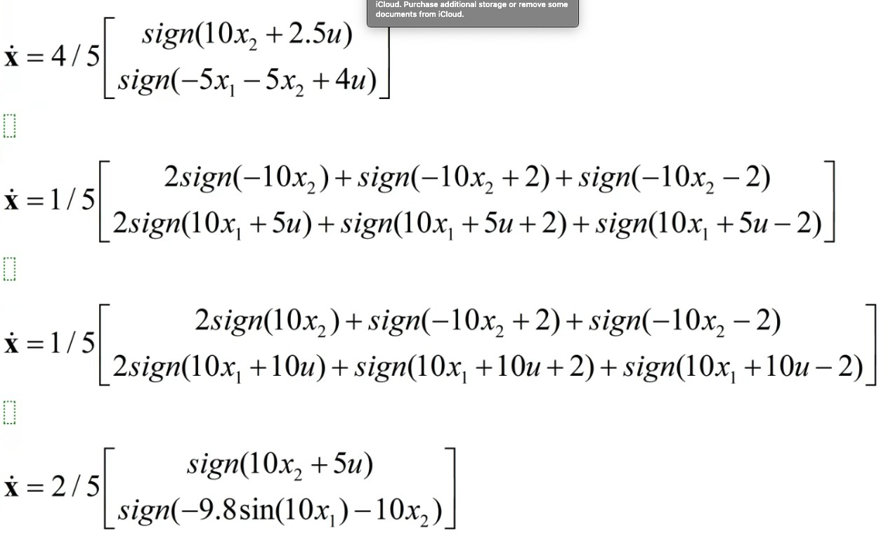

# Can U Control

# Files:

## server_base.py

Main server class code. This class should not be modified. Controllers should just instanciate the `server`class passing a controller and call run.

## sin_server.py

Demo file that creates a dummy controller and instanciates a server. The controller just keeps printing the received values and sends a sinusoidal control signal.

## hardware_control.py

Demo file that connects to an Arduino via serial and gets control signals from it. Normally the Arduino code should generate a control signal (for instance from a potentiometer) and send via serial as text. The controller then sends this value to the game as input.

## arduino_usb_serial

simple Arduino code for sending AD values to serial

# Message formats (websocket)

## control value

Controller must send a value in text format between -1 and 1

## sensor value

The controller receives (from the server) a list of ascii values with the following format:

[game, land, level, character_x, character_y, target_x, target_y, bonus_1_x, bonus_1_y,  bonus_2_x, bonus_2_y, bonus_3_x, bonus_3_y ] + [skull_1_x, skull_1_y, ... ]

Obs: The second list might contain only an empty string if there are no skulls in the level. Otherwise it will contain the x,y values for each skull

### game :

Index of how many times the player won the game. Starts at 0

### land :

Index of the land the player is in

LinearLand = 1

Non-LinearLand = 2

SwitchingLand = 3

QuantizedLand = 4

### level :

Index of the system the player is in, on the land. Starts at 1 and ends at 4.

OBS.: The equations for each level are:

LinearLand:

non-LinearLand:

SwitchingLand:

QuantizedLand:

